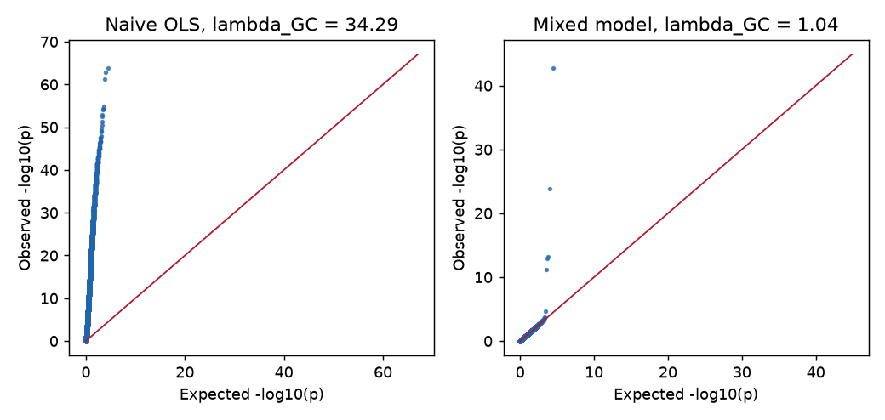
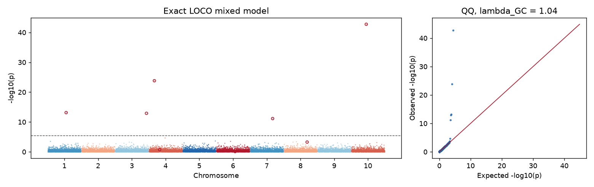
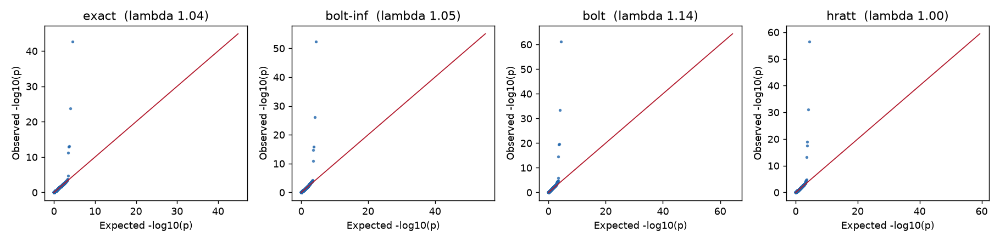

# mixmogam tutorial

A guided tour of what mixmogam does, on one simulated structured population.
Every number and figure below is produced by
[`tutorial/tutorial.py`](tutorial/tutorial.py), which runs in about a minute on
a laptop (the two mixture/elastic-net fits dominate, ~20 s each):

```sh
OPENBLAS_NUM_THREADS=1 OMP_NUM_THREADS=1 python docs/tutorial/tutorial.py
```

For the full option list see the [quickstart](quickstart.md); for the evidence
behind each method see the [research report](../report/README.md).

## 1. A structured population with known answers

1,500 samples from 5 diverged subpopulations (Fst scale 0.35), 15,000 variants
on 10 chromosomes, and a trait with heritability 0.6: half infinitesimal
polygenic background, half from 8 true QTL. Structure is what makes
association hard: ancestry shifts both genotype and trait.

```python
import numpy as np
from mixmogam import Genotypes, gwas
from mixmogam.simulate import simulate_genotypes, simulate_traits

G = simulate_genotypes(n=1500, m=15000, n_pop=5, pop_fst=0.35, seed=11)   # (m, n)
gt = Genotypes(G.T, chromosome=np.repeat(np.arange(1, 11), 1500),
               position=np.tile(np.arange(1500) * 1000, 10))
sim = simulate_traits(G, h2=0.6, n_causal=8, seed=12)
y = sim["y"]
```

With real data you would instead use `Genotypes.load_plink(prefix)`,
`read_phenotypes(...).complete("trait")`, `gt.align_samples(samples)` and
`gt.filter_variants(min_mac=5, max_missing=0.1)`; see the quickstart.

## 2. Why a mixed model

Per-SNP linear regression ignores relatedness. Here it is wrecked by structure:

| | λ_GC | Bonferroni hits (15,000 tests) |
|---|---|---|
| Naive OLS | 34.3 | 6,380 |
| Mixed model (`gwas`) | 1.04 | 5, all within 10 SNPs of a true QTL |



## 3. The headline call

```python
result = gwas(y, gt)             # n <= 5000 -> method="exact": EMMAX, REML refit per LOCO group
result.genomic_control()         # 1.042
result.extra["pseudo_heritability"]   # per LOCO group: 0.49 – 0.63 (truth 0.6)
result.top_snps(5)               # a GwasResult, smallest p first
result.write_csv("gwas.csv")
```

Leave-one-chromosome-out is the default: each SNP is tested against a
polygenic model built **without its own chromosome**, so the SNP cannot
absorb itself into the kinship (proximal contamination). The top hits:

| chr | position | p | β | se |
|---|---|---|---|---|
| 10 | 674000 | 1.8e-43 | −0.536 | 0.038 |
| 4 | 243000 | 1.5e-24 | +0.368 | 0.035 |
| 1 | 830000 | 7.2e-14 | +0.273 | 0.036 |
| 3 | 1414000 | 1.2e-13 | +0.254 | 0.034 |
| 7 | 1017000 | 7.1e-12 | +0.257 | 0.037 |

```python
from mixmogam.plotting import plot_manhattan, plot_qq
plot_manhattan(result, highlight=causal_indices)   # red rings = true QTL
plot_qq(result.p)
```



Five of the eight QTL clear Bonferroni. The other three have small simulated
effects (−log10 p of 0.1–3.3); no method below finds them either. Power is a
property of the effect sizes and n, not of the software.

## 4. One entry point, four engines

`method=` switches the statistical engine; the input and output stay the same.

```python
for method in ["exact", "bolt-inf", "bolt", "hratt"]:
    r = gwas(y, gt, method=method)
```

| method | time | λ_GC | Bonferroni hits | QTL found | hits far from a QTL |
|---|---|---|---|---|---|
| `exact` | 2.3 s | 1.042 | 5 | 5/8 | 0 |
| `bolt-inf` | 1.0 s | 1.051 | 5 | 5/8 | 0 |
| `bolt` | 20.5 s | 1.136 | 6 | 6/8 | 0 |
| `hratt` | 20.6 s | 0.999 | 5 | 5/8 | 0 |



How to read this honestly:

- `exact` is the reference at this size, and `method="auto"` picks it up to
  5,000 samples (`bolt-inf` above). The other engines exist for scale: they
  avoid the O(n³) factorizations and use less memory. At n = 1,500 they cost
  more, not less.
- `bolt` and `hratt` report larger −log10 p at the QTL than `exact` (e.g.
  57-61 vs 43 at the strongest one). That can reflect extra power from a
  non-infinitesimal prior, but also a different statistic and scale
  (retrospective score tests versus an F test), so compare calls and
  calibration, not raw p-values across methods.
- Both `bolt` and `hratt` raised "variational fit did not converge" on this
  small panel (`result.extra["cv_converged"]` and `["loco_converged"]` are
  `False`), and `bolt` has the highest λ (1.14). This is the intended
  warning: they are built for larger n and m, so inspect those flags before
  trusting a two-step fit, and prefer `exact` at this size.
- 6/8 for `bolt` versus 5/8 is one SNP in one simulation, not a power result.
  The matched benchmarks live in the report.

## 5. Case-control outcomes and sampling weights

Only HRATT models binary traits and weighted samples. Here the top 20% of the
liability are "cases". Following the docs, **include ancestry PCs** when
structure is present, because the score test models allele frequencies from
the covariates:

```python
K = kinship.realized_relationship(gt)
pcs = np.linalg.eigh(K)[1][:, -4:]                 # top 4 ancestry PCs
rb = gwas(y01, gt, X=pcs, method="hratt", trait="binary")
rw = gwas(y,   gt, X=pcs, method="hratt", sample_weights=w)   # e.g. 1/P(participation)
```

| | λ_GC | Bonferroni hits | far from a QTL |
|---|---|---|---|
| Binary, 20% prevalence, with PCs | 0.99 | 4 | 0 |
| Weighted (design effect 1.06), with PCs | 1.02 | 5 | 0 |

The first attempt without PCs gave λ_GC = 1.83 for the binary trait and an
explicit "strong population structure remains" warning, which is the
behaviour you want: the tool tells you the assumption failed. Binary `beta`
is a one-step log-odds approximation and is exported as `beta_one_step`;
don't read it as a fitted logistic coefficient. These paths are still
experimental; the validation in the README reports where they fall short.

## 6. From signals to independent loci: stepwise MLMM

Genome-wide scans report peaks, not independent effects. `mlmm` adds the
strongest SNP as a cofactor, refits the mixed model, and repeats, then prunes
backwards:

```python
from mixmogam.stepwise import mlmm
out = mlmm(y, gt, K=K, max_steps=8)
out["selected"]["ebic"]     # [830, 4414, 4743, 10017, 14174]
```

True QTL indices: 830, 4414, 4743, 4983, 8343, 10017, 11551, 14174. The
extended-BIC and multiple-Bonferroni rules both select 5 of them with no false
cofactors; plain BIC adds three more, of which one (11551) is a true QTL and two
(9650, 12899) are not. Note the pseudo-heritability column in `out["steps"]` falling from 0.60
to 0.35 as cofactors absorb variance that the kinship was carrying: that is
the multi-locus picture the single-SNP scan cannot give.

## 7. Heritability and a permutation threshold

```python
from mixmogam import LMM
fit = LMM(y, K=K).fit()
fit.pseudo_heritability            # 0.603 (simulated h² = 0.6)

from mixmogam.scan import permutation_min_p
permutation_min_p(fit, gt, n_perm=200)["threshold_05"]   # 4.25e-06
```

The permutation 5% threshold (4.3e-6, from only 200 permutations, so rough)
sits near Bonferroni (3.3e-6), as expected with mostly independent SNPs. With
dense, correlated markers the permutation threshold would be less strict than
Bonferroni; that is when it earns its cost. The permutation scheme was
corrected in 2.0.0 and still needs larger validation (README).

## 8. Scaling: threads and two-bit genotypes

```python
Genotypes(G.T, chromosome=..., position=..., packed=True)   # 2 bits per call
gwas(y, gt, method="hratt", n_threads=4)                    # `fast` extra, set BLAS threads to 1 first
```

Packed storage is a quarter of the int8 memory and gives identical results;
the tutorial checks this on the HRATT scan (maximum |Δp| = 0). On two
50,000 × 20,000 panels, four-thread HRATT took 29–33 s at 1.4 GiB, or 0.8 GiB
packed (README).

## Also available

GxE interaction scans (`scan_gxe`), genotypic (non-additive) tests,
two-kinship variance-component fits (`fit_two_kinships`), posterior
association probabilities with an explicit effect-size prior, and HDF5 /
EIGENSTRAT / PLINK I/O. See the quickstart.

## Caveats

- This is one simulation of one seed; it shows how to use the package, not how
  the methods rank. Method comparisons belong to the benchmark suite.
- A genome-wide λ_GC near 1 can hide miscalibration within SNP groups; look at
  the stratified diagnostics in the report before relying on it.
- Tests are conditional associations given the fitted polygenic covariance,
  not evidence of causation.
